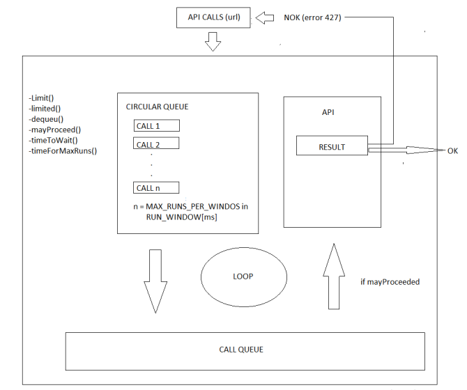

# NodejsApiQueue

A lot of REST API compatible services has so-called rate limiting to prevent DoS (Denial of Service) attacks and server overload. Some one has soft rules where you can cross their limits for a sort perioid. Someone has stricly rules, where you will  immediately get HTTP 429 as response and timeout after which you can give your request another try.

In this program you can simulate HTTP 429 situation. You can send as many API calls as you want in a given time. If API call fails, the program will sent call again using information the server sent for you. 

**Architecture**

**Key words**

NodeJS, JavaScript